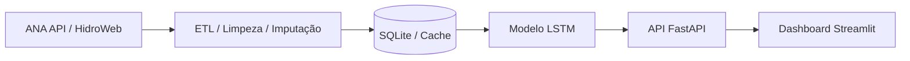

# Previsão Rio Aquidauana - MVP
Sistema de monitoramento hidrológico utilizando Deep Learning (LSTM).

## Como rodar
1. Tenha o Docker instalado.
2. Na raiz do projeto: `docker-compose up --build`.
3. Acesse a API em `http://localhost:8000/docs`.
4. Acesse o Frontend em `http://localhost:8501`.

## Estrutura
- `data/`: Ingestão de dados da ANA.
- `models/`: Artefatos do modelo (.keras).

# Engenharia e Decisões Técnicas

## Trade-offs na Escolha da Arquitetura

A seleção da arquitetura de aprendizado de máquina foi baseada na comparação entre diferentes abordagens amplamente empregadas na modelagem de séries temporais hidrológicas. A escolha da rede LSTM considerou não apenas o desempenho preditivo, mas também a capacidade de representar os processos hidrológicos característicos da bacia do Rio Aquidauana.

### Modelos Lineares e SARIMA

Modelos lineares e da família SARIMA foram avaliados inicialmente, porém descartados devido à limitação em representar relações não lineares entre precipitação e vazão. Esses métodos assumem estruturas lineares e apresentam desempenho reduzido em sistemas hidrológicos com elevada variabilidade estocástica, múltiplos mecanismos de armazenamento e forte influência sazonal, características observadas na bacia do Rio Aquidauana.

### XGBoost e Modelos Baseados em Árvores

Modelos baseados em árvores de decisão, como o XGBoost, apresentam elevada capacidade preditiva para problemas tabulares. Entretanto, sua aplicação em séries temporais hidrológicas exige extenso processo de *feature engineering* para representar explicitamente dependências temporais, defasagens e memória hidrológica. Esse processo aumenta significativamente a complexidade do desenvolvimento e pode limitar a capacidade de generalização do modelo.

### LSTM (Arquitetura Selecionada)

A arquitetura **Long Short-Term Memory (LSTM)** foi selecionada por sua capacidade de aprender automaticamente dependências temporais de curto e longo prazo presentes nas séries hidrológicas.

Entre suas principais vantagens destacam-se:

- representação da memória hidrológica da bacia;
- processamento simultâneo de múltiplas variáveis de entrada;
- integração das séries de precipitação provenientes de diferentes estações pluviométricas;
- capacidade de modelar relações não lineares entre precipitação e vazão;
- maior robustez para previsão de vazões em diferentes escalas temporais.

---

# Correção do Viés de Retranformação (Smearing Factor de Duan)

## Motivação

O treinamento do modelo foi realizado no domínio logarítmico (*log-space*), estratégia amplamente utilizada para estabilizar a variância das vazões e reduzir a influência dos eventos extremos durante o processo de otimização.

Entretanto, a simples aplicação da transformação inversa

$$
Q = e^{\hat{y}}
$$

introduz um viés sistemático decorrente da desigualdade de Jensen, resultando na subestimação dos valores esperados de vazão.

## Solução Adotada

Para eliminar esse viés foi implementada a **Correção de Duan (Smearing Estimate)**.

O fator de correção é estimado a partir dos resíduos do conjunto de treinamento:

$$
SF=\frac{1}{n}\sum_{i=1}^{n}e^{\varepsilon_i}
$$

onde:

- $SF$ é o *Smearing Factor*;
- $\varepsilon_i$ representa o resíduo no espaço logarítmico.

A previsão final é obtida por:

$$
\hat{Q}=SF \times e^{\hat{y}}
$$

Essa abordagem produz estimativas não enviesadas após a retransformação, preservando a coerência física das vazões previstas.

---

# Monitoramento da Saúde do Modelo

Para garantir confiabilidade operacional, a plataforma incorpora mecanismos de monitoramento contínuo do desempenho do modelo.

## Métricas de Desempenho

O painel apresenta continuamente indicadores de desempenho, incluindo:

- **NSE (Nash-Sutcliffe Efficiency);**
- **PBIAS (Percent Bias);**
- comparação entre vazões observadas e previstas;
- histórico de desempenho dos últimos sete dias.

Esses indicadores permitem avaliar continuamente a qualidade das previsões produzidas pelo modelo.

---

## Detecção de Data Drift

O sistema monitora continuamente a distribuição estatística das variáveis de entrada.

Quando a distribuição das precipitações observadas apresenta desvio significativo em relação aos dados utilizados durante o treinamento — por exemplo, superior a dois desvios-padrão —

$$
|z| > 2
$$

é emitido um alerta de **Data Drift**.

Esse mecanismo informa que o modelo está realizando previsões fora do domínio estatístico observado durante o treinamento, reduzindo a confiabilidade das estimativas e sinalizando a necessidade de reavaliação ou reentreinamento do modelo.

---

# Arquitetura da Plataforma

A Figura 1 apresenta o fluxo completo de aquisição, processamento e disponibilização das previsões hidrológicas.

> **Figura 1.** Arquitetura geral da plataforma de previsão hidrológica.

O fluxo operacional é composto pelas seguintes etapas:

1. Coleta automática dos dados hidrológicos por meio da API da ANA/HidroWeb;
2. Processamento ETL, incluindo limpeza, consistência e imputação de falhas;
3. Armazenamento local em banco SQLite para redução do tempo de acesso;
4. Execução do modelo LSTM responsável pela previsão das vazões;
5. Disponibilização dos resultados através de uma API desenvolvida em FastAPI;
6. Visualização dos indicadores operacionais e previsões em um dashboard interativo desenvolvido em Streamlit.